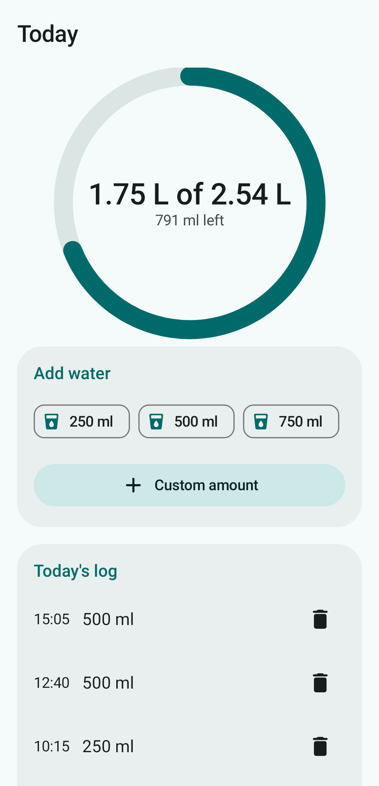
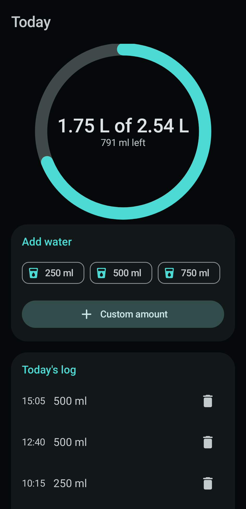
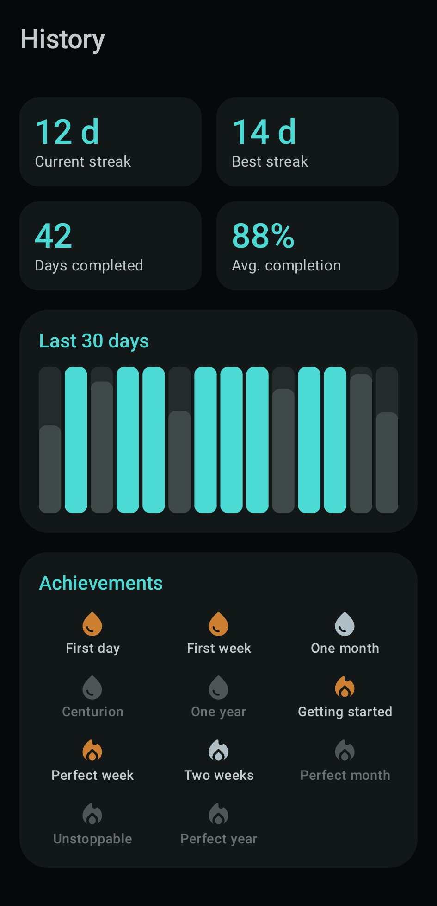
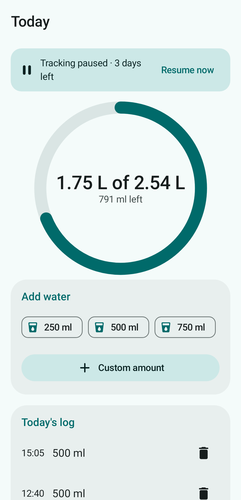
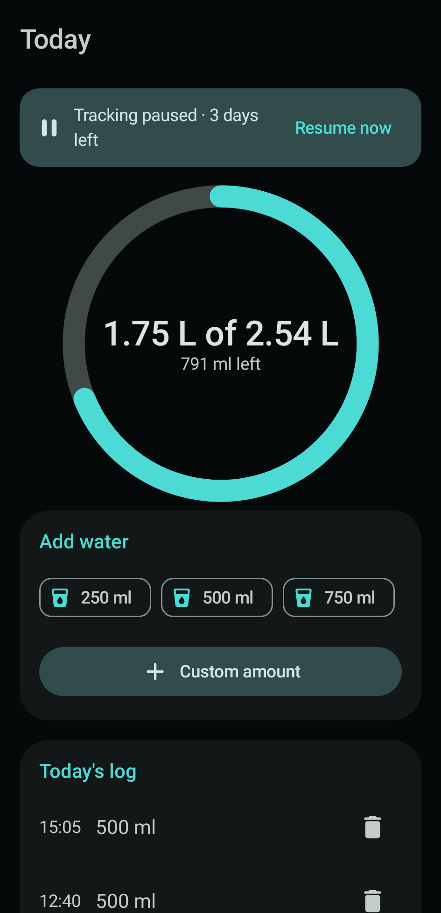

# Hydra

🇪🇸 Español · [🇬🇧 English](README.md)

App Android para registrar la ingesta diaria de agua y recibir recordatorios para tomar,
pensada para **proteger el riñón** (no pasar ~1 L/h, reducir la ingesta de noche) y
**reforzar el hábito**. 100% **offline** — sin permiso de internet ni permisos invasivos.

## Capturas

<p>
  
  
  
  
  
  
</p>

## Características

- **Meta diaria** = factor (ml/kg) × peso. Factor 33 normal, 40 en *modo calor*. Ajuste ±15%.
- **Recordatorios** (WorkManager) que reparten la ingesta de la mañana a la tarde respetando el
  corte nocturno, con **redistribución inteligente** si te atrasás y tope ~1 L/h. Las
  notificaciones traen acciones rápidas ("Registré X" / "Posponer").
- **Inferencia de estación offline** (país por *locale* + fecha → hemisferio → estación) que
  sugiere el modo calor. No lee el clima real (sin internet ni sensores).
- **Modo simple** (valores bloqueados a la fórmula correcta) y **modo avanzado** (factor, ventana,
  frecuencia, tope/hora, % de ajuste y tamaños rápidos editables).
- **Historial y gamificación**: rachas (actual/mejor), gráfico de 30 días, logros, lista por día,
  y una celebración al cumplir la meta. Un día cuenta al 100% de la meta.
- **Balance mañana/tarde**: la meta se reparte 65% en la primera mitad de la ventana despertar→corte
  y 35% en la segunda (ajustable 45–70% en modo avanzado, la tarde es siempre el complemento). El
  adelanto matinal acompaña el ritmo circadiano y, junto con el corte nocturno, reduce las idas al
  baño de madrugada — en línea con las guías clínicas de nocturia (restricción vespertina de líquidos).
- **Pausa de registro** (5, 10 o 30 días): apaga los recordatorios sin desinstalar. Los días en
  pausa **no cortan la racha** (son neutros, salvo que igual cumplas la meta: entonces cuentan),
  podés seguir registrando si querés, y se reanuda solo al vencer o antes con "Reanudar".
- **Modo oscuro moderno** (Material 3), **español e inglés**, **métrico e imperial**, país editable.
- **Backup configurable**: solo local (default), auto-backup de Android, o export/import JSON.

## Stack

Kotlin · Jetpack Compose · Material 3 · Room · DataStore · WorkManager.
minSdk 26, target/compile 34, JDK 17, AGP 8.2.2, Gradle 8.5 (mismo toolchain que el proyecto
hermano `cast-bridge`).

## Build

Docker Desktop tiene que estar corriendo (no hace falta JDK / Android SDK locales).

### APK de release (firmado)

```bash
cp .env.example .env      # poné las contraseñas del keystore
./build-apk.sh            # Linux/macOS  (Windows: build-apk.bat)
# Salida: app-output/Hydra.apk
adb install app-output/Hydra.apk
```

El primer build genera `hydra-release.keystore` (git-ignored) en la raíz del proyecto y los
siguientes lo reutilizan, así las versiones nuevas se actualizan sin desinstalar. **Hacé backup
de `.env` y del keystore juntos** — si se pierden, los builds futuros no podrán actualizar la
app instalada.

### Desarrollo (compilar, tests, capturas) con la imagen toolchain reutilizable

```bash
docker build -f docker/toolchain.Dockerfile -t hydra-toolchain docker/
# Compilar + correr todos los escenarios Gherkin
docker run --rm -v "$PWD:/project" -v hydra-gradle:/root/.gradle hydra-toolchain \
    gradle :app:assembleDebug :app:testDebugUnitTest
# Regenerar las capturas del README
docker run --rm -v "$PWD:/project" -v hydra-gradle:/root/.gradle hydra-toolchain \
    gradle :app:recordRoborazziDebug --tests "*ScreenshotTest"
```

Con JDK 17 + Android SDK locales también podés usar el wrapper: `./gradlew test`.

## Testing

El comportamiento se especifica en **Gherkin** (`app/src/test/resources/features/*.feature`) y se
ejecuta con **Cucumber-JVM** (dominio + integración in-memory) — 57 escenarios. Las capturas se
renderizan sin emulador con **Roborazzi + Robolectric**.

## Privacidad

La app **no declara INTERNET** ni permisos de ubicación/sensores, así que ningún dato puede salir
del dispositivo (salvo que actives el auto-backup de Android o exportes un JSON a mano). El único
permiso que concede el usuario es `POST_NOTIFICATIONS` (Android 13+). WorkManager agrega algunos
permisos *normales* de instalación (`ACCESS_NETWORK_STATE`, `WAKE_LOCK`, `RECEIVE_BOOT_COMPLETED`,
`FOREGROUND_SERVICE`) para programar los recordatorios de forma confiable; ninguno da acceso a la red.

## Licencia

[MIT](LICENSE) © 2026 Sergio Emanuel Napoli. Libre para usar, modificar y distribuir,
sin garantía. No es consejo médico — ver los descargos dentro de la app.
