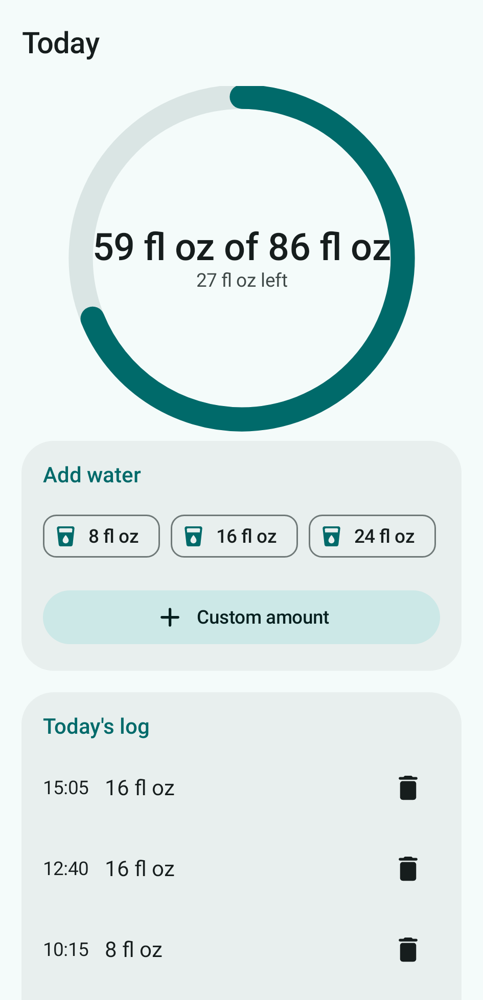
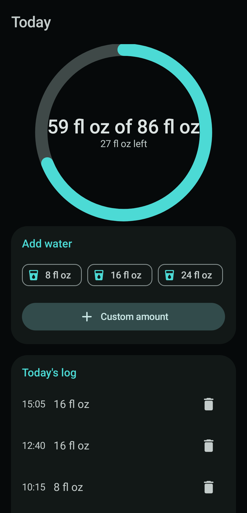
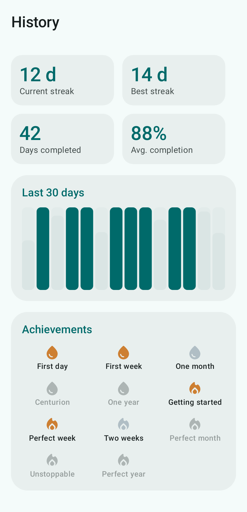

# Hydra

🇬🇧 English · [🇪🇸 Español](README.es.md)

Android app to track daily water intake and get reminders to drink, designed to
**protect the kidney** (stay under ~1 L/h, taper off at night) and **reinforce the
habit**. 100% **offline** — no internet permission, no invasive permissions.

## Screenshots

<p>
  
  
  
  
  
  
</p>

## Features

- **Daily goal** = factor (ml/kg) × weight. Factor 33 normal, 40 in *heat mode*. ±15% adjustment.
- **Reminders** (WorkManager) spread intake from morning to evening, respecting a night cutoff,
  with **smart redistribution** if you fall behind and a ~1 L/h cap. Notifications have quick
  actions ("I drank X" / "Snooze").
- **Offline season inference** (locale country + date → hemisphere → season) suggests heat mode.
  It does not read real weather (no internet, no sensors).
- **Simple mode** (values locked to the correct formula) and **advanced mode** (editable factor,
  window, frequency, hourly cap, % adjustment and quick-add sizes).
- **History & gamification**: streaks (current/best), 30-day bar chart, achievements, per-day list,
  and a celebration when you hit your goal. A day counts at 100% of the goal.
- **Morning/afternoon balance**: the goal is paced 65% into the first half of the wake→cutoff
  window and 35% into the second (adjustable 45–70% in advanced mode; the afternoon is always the
  complement). Front-loading follows the circadian rhythm and, together with the night cutoff,
  reduces night-time bathroom trips — in line with clinical nocturia guidance (evening fluid
  restriction).
- **Pause tracking** (5, 10 or 30 days): silences reminders without uninstalling. Paused days
  **don't break your streak** (they're neutral — unless you still hit the goal, then they count),
  you can keep logging if you want, and tracking resumes automatically or earlier via "Resume".
- **Modern dark mode** (Material 3), **Spanish & English**, **metric & imperial**, editable country.
- **Configurable backup**: local only (default), Android auto-backup, or JSON export/import.

## Stack

Kotlin · Jetpack Compose · Material 3 · Room · DataStore · WorkManager.
minSdk 26, target/compile 34, JDK 17, AGP 8.2.2, Gradle 8.5 (same toolchain as the sibling
`cast-bridge` project).

## Build

Docker Desktop must be running (no local JDK / Android SDK needed).

### Signed release APK

```bash
cp .env.example .env      # set the keystore passwords
./build-apk.sh            # Linux/macOS  (Windows: build-apk.bat)
# Output: app-output/Hydra.apk
adb install app-output/Hydra.apk
```

The first build generates `hydra-release.keystore` (git-ignored) in the project root and
later builds reuse it, so new versions upgrade in place. **Back up `.env` and the keystore
together** — losing them means future builds can't update the installed app.

### Dev (compile, tests, screenshots) with the reusable toolchain image

```bash
docker build -f docker/toolchain.Dockerfile -t hydra-toolchain docker/
# Compile + run all Gherkin scenarios
docker run --rm -v "$PWD:/project" -v hydra-gradle:/root/.gradle hydra-toolchain \
    gradle :app:assembleDebug :app:testDebugUnitTest
# Regenerate README screenshots
docker run --rm -v "$PWD:/project" -v hydra-gradle:/root/.gradle hydra-toolchain \
    gradle :app:recordRoborazziDebug --tests "*ScreenshotTest"
```

With a local JDK 17 + Android SDK you can also use the wrapper: `./gradlew test`.

## Testing

The behaviour is specified in **Gherkin** (`app/src/test/resources/features/*.feature`) and
executed with **Cucumber-JVM** (domain + in-memory integration) — 57 scenarios. Screenshots are
rendered headlessly with **Roborazzi + Robolectric** (no emulator).

## Privacy

The app declares **no INTERNET** and no location/sensor permissions, so no data can leave the
device (unless you enable Android auto-backup or export a JSON yourself). The only permission the
user grants is `POST_NOTIFICATIONS` (Android 13+). WorkManager merges in a few *normal*
install-time permissions (`ACCESS_NETWORK_STATE`, `WAKE_LOCK`, `RECEIVE_BOOT_COMPLETED`,
`FOREGROUND_SERVICE`) for reliable background scheduling; none grant network access.

## License

[MIT](LICENSE) © 2026 Sergio Emanuel Napoli. Free to use, modify and distribute, with
no warranty. Not medical advice — see the in-app disclaimers.
