# Hydra

🇬🇧 English · [🇪🇸 Español](README.es.md)

Android app to track daily water intake and get reminders to drink, designed to
**protect the kidney** (stay under ~1 L/h, taper off at night) and **reinforce the
habit**. 100% **offline** — no internet permission, no invasive permissions.

## Screenshots

<p>
  
  
  
  
  
  
  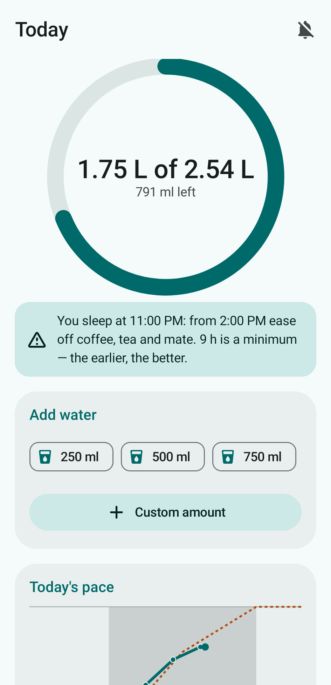
  
</p>

Full pages — Home with today's pace curve, and the complete history page on the **90-day period**,
so you can see one control scoping every card at once (rendered from 12 weeks of sample data):

<p>
  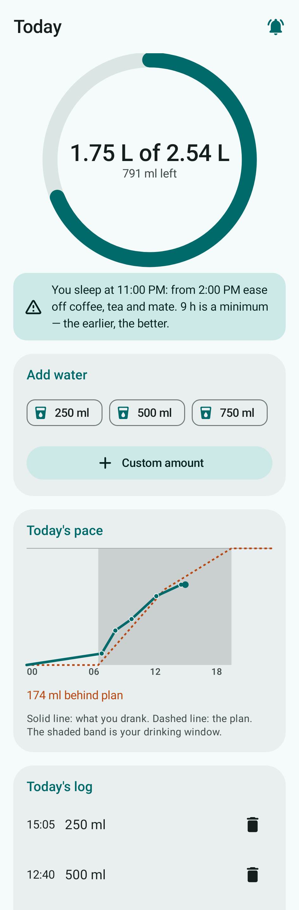
  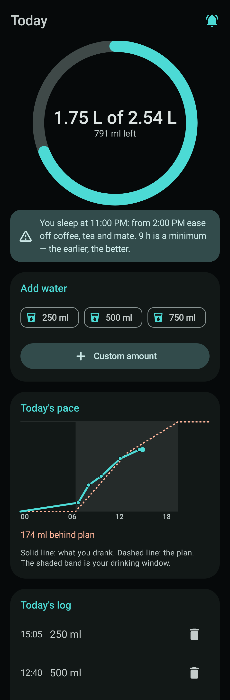
</p>
<p>
  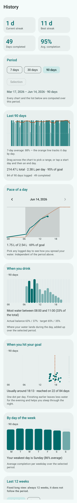
  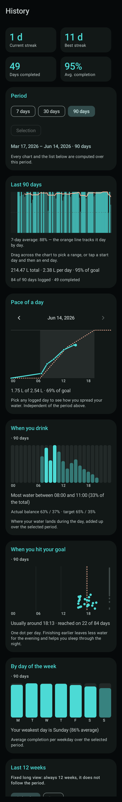
</p>

The 12-week card in both readings, from a history that only starts 60 days ago — the weeks with no
record are dashed outlines in the calendar and simply absent from the bars, and the first partial
week sits low because gaps count as zero:

<p>
  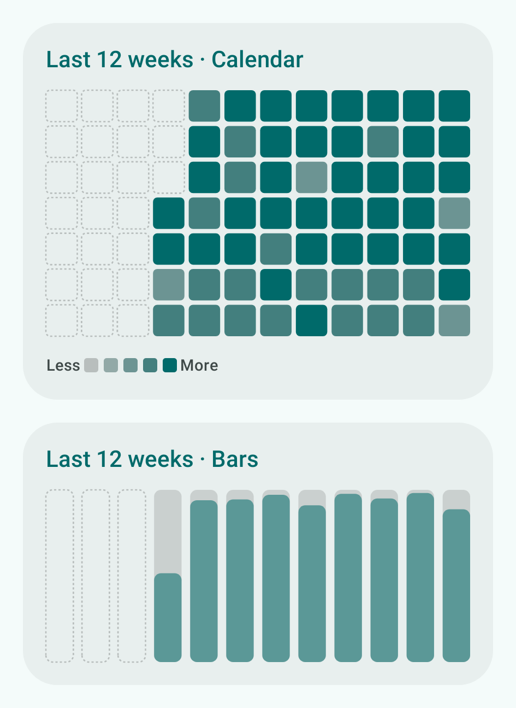
  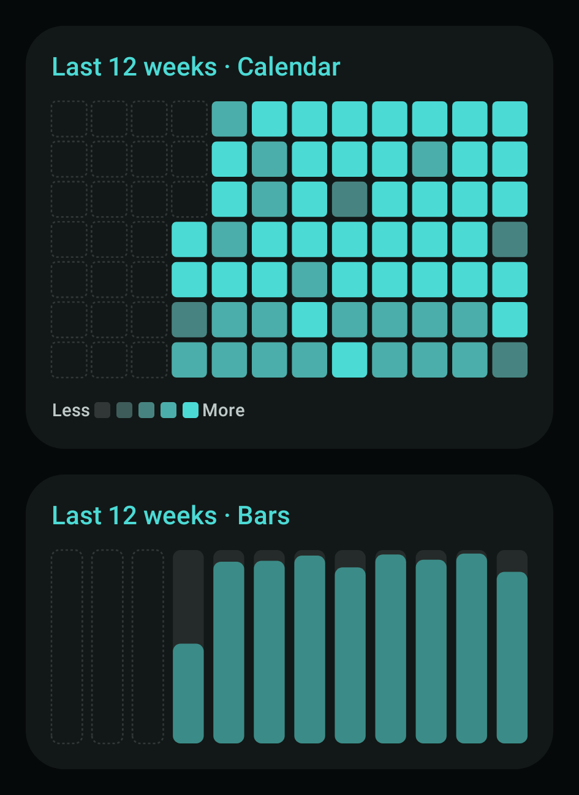
</p>

A closed 21-day pick: the chart zooms into the range, the card is titled after it, and "Show 30
days" is the way back out.

<p>
  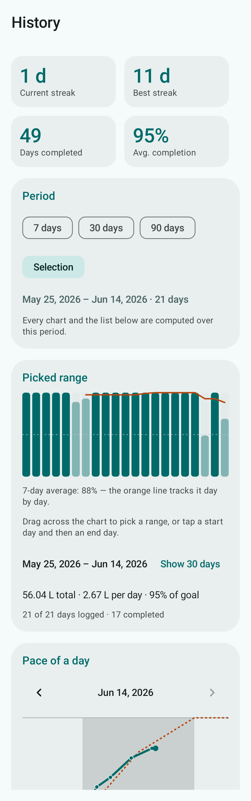
  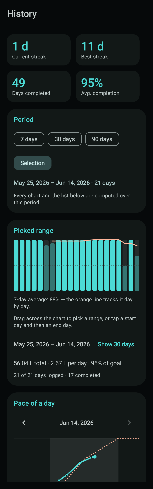
</p>

A young install (11 days logged) with a range pick in progress — empty calendar slots, a 7-day
average that only starts once seven consecutive days exist, and the highlighted start day:

<p>
  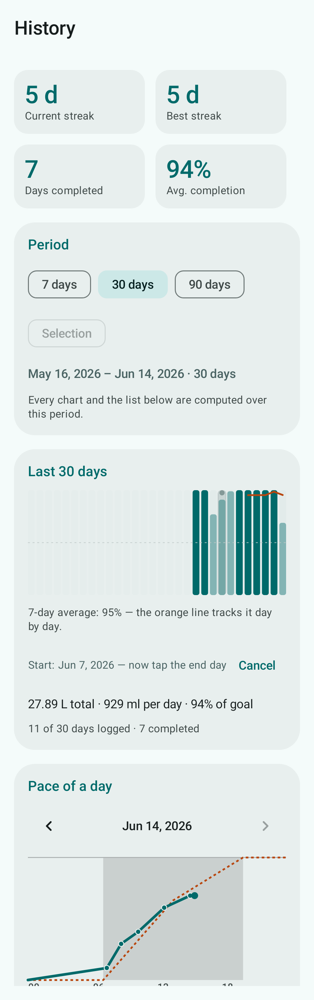
  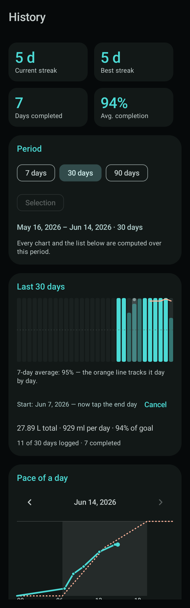
</p>

## Features

- **Daily goal** = factor (ml/kg) × weight. Factor 33 normal, 40 in *heat mode*. ±20% adjustment.
- **The day changes at midnight.** Water drunk after 00:00 counts for the new day, and the screen
  follows the boundary live: leaving the app open across midnight rolls it over on its own. The wake
  and sleep times only bound the hours in which reminders may be sent — they never move the day.
- **Reminders** (WorkManager) spread intake from morning to evening, respecting a night cutoff.
  Each one suggests an amount worked out on the spot: what you still owe, divided by the reminders
  that still fit before the cutoff, capped at ~1 L/h so it never asks for more than your kidneys
  can process. Drift far enough behind the pace and it reminds you out of turn. Notifications have
  quick actions ("I drank X" / "Snooze").
- **Mute reminders for today** with one tap from the Home top bar (bell icon). Logging and
  streaks are untouched, and the mute expires by itself the next day.
- **Caffeine notice** on Home, from 9 h before your bedtime, suggesting you ease off coffee, tea
  and mate. Expressed in hours before bedtime rather than a fixed hour, so changing your sleep
  time moves it. On by default and switchable from *Settings › Schedule*; purely advisory — it
  touches neither the goal, nor the streaks, nor the reminders. The 9 h rounds the 8.8 h that
  [Gardiner et al. (2023)](https://www.sciencedirect.com/science/article/pii/S1087079223000205)
  identify as the point where a standard coffee stops measurably shortening sleep, and it is
  stated as a *minimum* because dose drives the spread:
  [Drake et al. (2013)](https://pubmed.ncbi.nlm.nih.gov/24235903/) put the sleep-hygiene floor at
  6 h, and a [2024 crossover trial](https://academic.oup.com/sleep/article/48/4/zsae230/7815486)
  found 400 mg still fragmenting sleep 8 h out.
- **Offline season inference** (locale country + date → hemisphere → season) suggests heat mode.
  It does not read real weather (no internet, no sensors).
- **Simple mode** (values locked to the correct formula) and **advanced mode** (editable factor,
  window, frequency, hourly cap, % adjustment and quick-add sizes).
- **History & gamification**: streaks (current/best), achievements, per-day list, and a celebration
  when you hit your goal. A day counts at 100% of the goal.
- **One period for the whole history page.** A single **Period** card at the top — 7, 30 or 90
  days, or a range you draw yourself — scopes the day chart, its totals, the day list and every
  chart below it. It prints the exact days it resolves to, and each card it governs carries a
  matching badge, so it is never a guess which control moves what. The 12-week heat-map is the
  one deliberate exception, and it says so on screen.
- **Seven charts**, all offline and computed from your own data:
  - **Today's pace** (Home) — what you drank vs. the plan, on a 24 h axis, with how far ahead or
    behind you are, and a dot per drink so you can see *when* each glass landed. It draws the
    *same* target the reminders use, so they can never disagree.
  - **Pace of a day** (History) — the same curve for any day you have logged, with its own
    `‹ date ›` stepper that walks recorded days only. Deliberately independent of the period
    control, and rebuilt from that day's own frozen snapshot — goal, wake time, night cutoff and
    morning/afternoon balance — so changing your profile never rewrites how a past day looks.
  - **Day chart** — one calendar slot per day of the period (a day with no record stays an empty
    track, never a fake 0%), plus a **7-day rolling average** line. The line only appears where a
    full 7-day window exists, so it never passes a 2-day mean off as a weekly average — and it
    stays away entirely on a 7-day period, where it could only ever be a single dot.
  - **Pick a date range**: drag across the chart, or tap a start day and then an end day. The
    chart **zooms into** the pick and the whole page follows it; "Show 30 days" zooms back out.
    Days with no record still count against the daily average, so gaps stay visible. A pick is
    all-or-nothing: tap anywhere off the bars — including on another chart — or press "Cancel" to
    abandon one, and switching period discards the range, so a new range always starts from two
    fresh taps.
  - **By day of the week** — average completion per weekday over the period, and your weakest day.
  - **Last 12 weeks** — the long view, always 12 weeks, in either of two readings you can switch
    between (the choice is remembered):
    - *Calendar* — one square per day. The stronger the colour, the closer you got; a **dashed
      outline** is a day with no record. The ramp is built outwards from the card colour, so it
      reads the same way in the light and dark themes.
    - *Bars* — one bar per week at that week's average completion, for trend instead of texture.
      Days with no record count as zero inside a week, so a week you forgot to log doesn't look
      perfect; a week with nothing at all draws no bar.
  - **When you drink** — hour-of-day distribution over the period. It highlights your busiest
    3-hour block and compares the morning/afternoon balance you **actually** achieved against the
    one you **configured**.
  - **When you hit your goal** — one dot per day at the time you crossed 100%, with your typical
    (median) time. Finishing earlier leaves less water for the evening.
- **Morning/afternoon balance**: the goal is paced 65% into the first half of the wake→cutoff
  window and 35% into the second (adjustable 45–70% in advanced mode; the afternoon is always the
  complement). Front-loading follows the circadian rhythm and, together with the night cutoff,
  reduces night-time bathroom trips — in line with clinical nocturia guidance (evening fluid
  restriction).
- **Pause tracking** (5, 10 or 30 days): silences reminders without uninstalling. Paused days
  **don't break your streak** (they're neutral — unless you still hit the goal, then they count),
  you can keep logging if you want, and tracking resumes automatically or earlier via "Resume".
- **Modern dark mode** (Material 3), **Spanish & English**, **metric & imperial**, editable country.
- **Backup**: export your whole history to a JSON file and import it back, and the app is included
  in Android's own app backup. Every export and import ends in a confirmation stating how many days
  and entries it moved, or why it failed (unreadable file, not a Hydra backup, newer app version).

## Stack

Kotlin · Jetpack Compose · Material 3 · Room · DataStore · WorkManager.
minSdk 26, target/compile 34, JDK 17, AGP 8.2.2, Gradle 8.5 (same toolchain as the sibling
`cast-bridge` project).

## Build

Docker Desktop must be running (no local JDK / Android SDK needed).

### Signed release APK

```bash
cp .env.example .env      # set the keystore passwords
./build-apk.sh            # Linux/macOS  (Windows: build-apk.bat)
# Output: app-output/Hydra.apk
adb install app-output/Hydra.apk
```

The first build generates `hydra-release.keystore` (git-ignored) in the project root and
later builds reuse it, so new versions upgrade in place. **Back up `.env` and the keystore
together** — losing them means future builds can't update the installed app.

### Dev (compile, tests, screenshots) with the reusable toolchain image

```bash
docker build -f docker/toolchain.Dockerfile -t hydra-toolchain docker/
# Compile + run all Gherkin scenarios
docker run --rm -v "$PWD:/project" -v hydra-gradle:/root/.gradle hydra-toolchain \
    gradle :app:assembleDebug :app:testDebugUnitTest
# Regenerate README screenshots
docker run --rm -v "$PWD:/project" -v hydra-gradle:/root/.gradle hydra-toolchain \
    gradle :app:recordRoborazziDebug --tests "*ScreenshotTest"
```

With a local JDK 17 + Android SDK you can also use the wrapper: `./gradlew test`.

## Testing

The behaviour is specified in **Gherkin** (`app/src/test/resources/features/*.feature`) and
executed with **Cucumber-JVM** (domain + in-memory integration) — 182 scenarios. Three focused JUnit
tests cover what Gherkin can't express: midnight re-keying of the live flows (on a clock wired to
virtual time), the Room cascade rule for the open day, and the database migration (a real on-disk
v1 file driven through the upgrade). Screenshots are rendered headlessly with
**Roborazzi + Robolectric** (no emulator) from 12 weeks of deterministic sample data run through the
real analytics (`app/src/test/.../screenshots/SampleData.kt`). 210 tests in total.

## Privacy

The app declares **no INTERNET** and no location/sensor permissions, so no data can leave the
device (unless you enable Android auto-backup or export a JSON yourself). The only permission the
user grants is `POST_NOTIFICATIONS` (Android 13+). WorkManager merges in a few *normal*
install-time permissions (`ACCESS_NETWORK_STATE`, `WAKE_LOCK`, `RECEIVE_BOOT_COMPLETED`,
`FOREGROUND_SERVICE`) for reliable background scheduling; none grant network access.

## License

[MIT](LICENSE) © 2026 Sergio Emanuel Napoli. Free to use, modify and distribute, with
no warranty. Not medical advice — see the in-app disclaimers.
